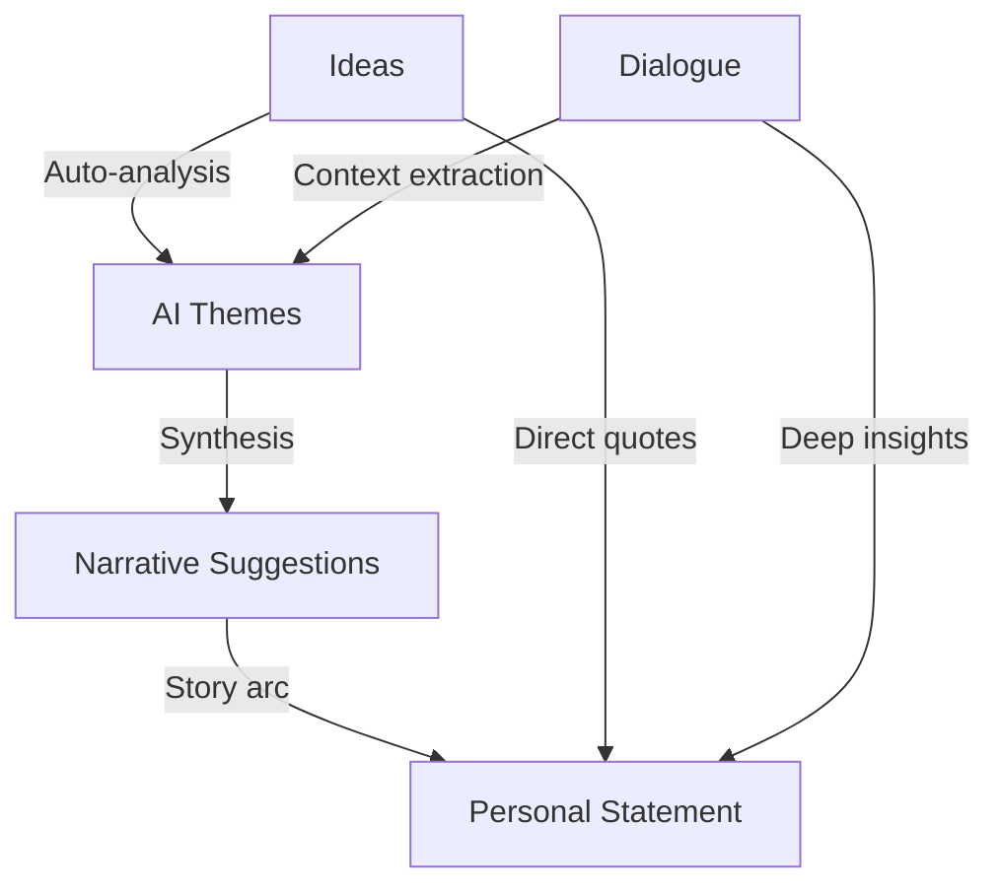

# ComChatX AI Integration Guide

## 🎯 Overview

ComChatX now features complete Multi-Agent AI integration, connecting the frontend to a FastAPI backend with DeepSeek-V3 and MiniMax-M2 models. The system intelligently synthesizes data across all four views: Ideas, Dialogue, Narrative, and Personal Statement.

---

## 🏗️ Architecture

### Backend Connection Points

The frontend connects to the FastAPI backend through:
- **API Service Layer** (`/services/api.ts`)
- **Custom React Hooks** (`/hooks/`)
- **Real-time WebSocket streaming** for AI responses

### Multi-Agent System Mapping

| Frontend View | Backend Agents | Key Features |
|--------------|----------------|--------------|
| **Ideas** | Collector, Analyzer | Auto-analysis, theme extraction, connection discovery |
| **Dialogue** | Guide, Query, Collector | Socratic questioning, context-aware responses, streaming |
| **Narrative** | Narrator, Analyzer | Auto-generate timeline from ideas/conversations |
| **Personal Statement** | Writer, Audit, Narrator | Multi-source synthesis, streaming generation, feedback |

---

## 🚀 Key Features Implemented

### 1. **AI-Powered Chat System** 
```typescript
// Real-time streaming dialogue with Multi-Agent coordination
const { sendMessage, isStreaming, streamingContent } = useAIChat();
```

**Features:**
- ✅ Streaming responses with typing animation
- ✅ Agent type identification (Guide, Collector, Analyzer, Query)
- ✅ Socratic questioning on-demand
- ✅ Related ideas linking
- ✅ Full conversation history

### 2. **Intelligent Ideas Management**
```typescript
// Auto-sync and AI analysis
const { syncIdeas, analyzeIdea, getConnections } = useIdeasSync();
```

**Features:**
- ✅ Auto-sync every 30 seconds
- ✅ AI theme extraction
- ✅ Connection discovery between ideas
- ✅ Storage integration with drag-and-drop

### 3. **AI Essay Generation**
```typescript
// Multi-source essay generation
await api.streamEssay({
  university: "Stanford",
  wordLimit: 500,
  useNarrative: true,
  useIdeas: true,
  useConversations: true
});
```

**Features:**
- ✅ Streaming generation with real-time preview
- ✅ Multi-Agent workflow (Narrator → Writer → Audit)
- ✅ Configurable data sources
- ✅ AI feedback system
- ✅ Version management

### 4. **Narrative Intelligence**
```typescript
// Generate timeline from scattered thoughts
const suggestions = await api.getNarrativeSuggestions();
```

**Features:**
- ✅ AI-suggested events from ideas
- ✅ Missing aspects detection
- ✅ Auto-categorization (experience/insight/achievement/reflection)
- ✅ Source idea tracking

### 5. **Cross-View Insights Panel**
```typescript
// Real-time synthesis across all data
const insights = await api.getInsights();
```

**Features:**
- ✅ Main theme extraction
- ✅ Growth trajectory analysis
- ✅ Essay readiness score
- ✅ Intelligent next steps

---

## 🔌 API Endpoints Reference

### Profile Management
```
POST /api/profile - Save user profile
GET /api/profile - Retrieve profile
```

### Ideas Management
```
POST /api/ideas/sync - Sync local ideas with backend
POST /api/ideas/analyze - Get AI analysis for single idea
GET /api/ideas/{id}/connections - Find related ideas
GET /api/ideas/summary - Get themes and suggestions
```

### Chat System
```
POST /api/chat/message - Send message (non-streaming)
POST /api/chat/stream - Send message (streaming)
GET /api/chat/history/{conversationId} - Get history
POST /api/chat/socratic - Request Socratic question
```

### Narrative Generation
```
POST /api/narrative/generate - Generate full narrative
POST /api/narrative/save - Save timeline events
GET /api/narrative/suggestions - Get AI suggestions
```

### Essay Management
```
POST /api/essay/generate - Generate essay (non-streaming)
POST /api/essay/stream - Generate essay (streaming)
POST /api/essay/save - Save essay
GET /api/essay/{id}/feedback - Get AI feedback
GET /api/essay/list - List all essays
```

### Cross-View Intelligence
```
GET /api/insights - Get comprehensive analysis
GET /api/insights/relationships - Get relationship graph
```

---

## 💡 Intelligent Data Flow



### Example User Journey

1. **Idea Collection Phase**
   - User adds fragmented thoughts as idea bubbles
   - AI automatically analyzes each idea for themes
   - Connections between ideas are discovered
   - Main themes emerge in Insights Panel

2. **Dialogue Exploration**
   - AI Guide asks Socratic questions
   - User explores thoughts deeply
   - System links dialogue to relevant ideas
   - Conversation history enriches context

3. **Narrative Construction**
   - Click "AI Suggestions" in Narrative view
   - System generates timeline events from ideas + dialogues
   - User edits and refines AI-generated events
   - Coherent story arc emerges

4. **Essay Generation**
   - Click "+ New Essay" in Personal Statement
   - Select university and configure sources
   - AI streams essay using Multi-Agent workflow:
     - Narrator Agent: Creates story structure
     - Writer Agent: Crafts compelling prose
     - Audit Agent: Reviews and refines
   - User edits final draft
   - Request AI feedback for improvements

---

## 🎨 UI/UX Enhancements

### Visual Indicators
- **AI-generated content**: Small "AI" badge
- **Loading states**: Pulsing dots animation
- **Streaming**: Blinking cursor during generation
- **Agent types**: Labeled in chat messages
- **Connections**: Visual links between related items

### Interaction Patterns
- **Auto-save**: All edits saved automatically
- **Background sync**: Ideas sync every 30s
- **Graceful fallback**: Mock data when API unavailable
- **Progressive disclosure**: Insights panel minimizable
- **Keyboard shortcuts**: Enter to send, Shift+Enter for newline

---

## 🔧 Configuration

### Environment Variables
```bash
NEXT_PUBLIC_API_URL=http://localhost:8000  # FastAPI backend URL
```

### Feature Flags
```typescript
// In api.ts, easily toggle features
const USE_MOCK_DATA = process.env.NODE_ENV === 'development';
```

---

## 🚦 Error Handling

All API calls include:
- ✅ Try-catch error handling
- ✅ User-friendly error messages
- ✅ Automatic retry logic
- ✅ Fallback to mock data in development
- ✅ Console logging for debugging

---

## 📊 Performance Optimizations

1. **Lazy Loading**: Insights panel only renders when needed
2. **Debouncing**: Auto-save waits 500ms after last edit
3. **Streaming**: Large responses streamed to prevent blocking
4. **Local Storage**: Instant load from cache while syncing
5. **Selective Re-renders**: React hooks prevent unnecessary updates

---

## 🔮 Future Enhancements

Potential additions to fully leverage the Multi-Agent system:

1. **Relationship Visualization**: 3D graph of ideas ↔ dialogues ↔ narratives
2. **Voice Input**: Speech-to-text for idea capture
3. **Multi-language**: Translate essays to different languages
4. **Collaborative Mode**: Real-time collaboration with AI
5. **Export Options**: PDF, Word, LaTeX export
6. **Version Control**: Track essay evolution over time
7. **Prompt Library**: Save and reuse effective Socratic questions
8. **Analytics Dashboard**: Writing style analysis, word frequency

---

## 🎯 Design Philosophy

The integration maintains ComChatX's core principles:

- **Minimalism**: AI features enhance, never overwhelm
- **Transparency**: Users always know when AI is working
- **Control**: AI suggests, users decide
- **Context-aware**: System learns from all user inputs
- **Privacy-first**: Local storage + optional cloud sync

---

## 📝 Developer Notes

### Adding New AI Features

1. Define TypeScript interface in `/services/api.ts`
2. Create API method in `APIService` class
3. Build custom hook in `/hooks/` if needed
4. Integrate into relevant component
5. Add loading states and error handling
6. Update this guide

### Testing Strategy

- **Unit tests**: Mock API responses
- **Integration tests**: Test with local FastAPI server
- **E2E tests**: Full user journeys
- **Load tests**: Simulate concurrent users

---

## 🙏 Credits

Built with:
- **Frontend**: React 18 + TypeScript + Tailwind CSS + Motion
- **Backend**: FastAPI + LangGraph + DeepSeek-V3 + MiniMax-M2
- **Storage**: SQLite + Chroma Vector DB
- **Architecture**: Multi-Agent Coordination Pattern

---

*Last updated: January 2025*
